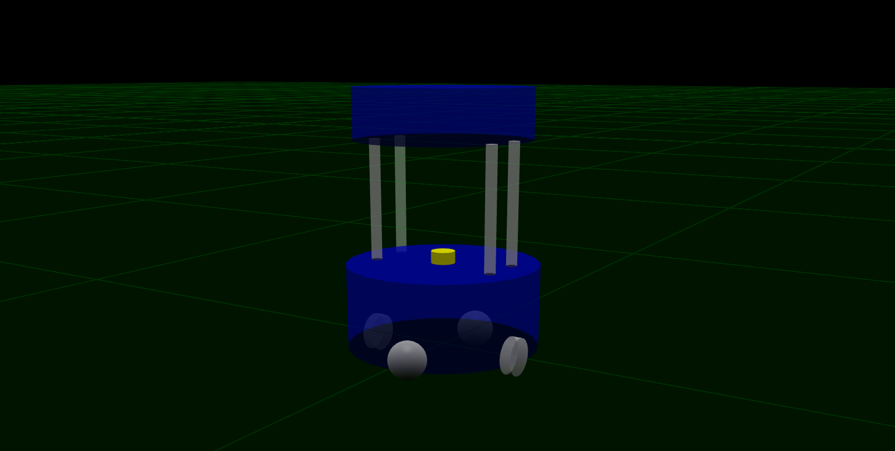

# Barista Robot (from scratch)

Target is to create a working robot using the URDF, defining all the required links & joints, adding required actuators and sensors, also create launch files to spawn robot in gazebo environment (world), then re-factor it using `XACRO` macros.

  

## Structure

```text
.
├── CMakeLists.txt
├── launch
│   ├── barista_two_robots.launch.py
│   ├── barista_urdf.launch.py
│   └── barista_xacro.launch.py
├── meshes
│   ├── hokuyo_urg_04lx.dae
│   └── hokuyo_urg_04lx.stl
├── package.xml
├── README.md
├── rviz
│   └── config.rviz
├── urdf
│   └── barista_robot_model.urdf
├── worlds
│   └── empty.world
└── xacro
    ├── barista_robot_model.urdf.xacro
    ├── base.xacro
    ├── cup_holder_tray.xacro
    ├── laser.xacro
    ├── standoff.xacro
    └── wheel.xacro
```

## Setup

#### Distribution

Use docker for quick-start (for both ROS1 or ROS2):

```sh
# using docker for ROS1
$ docker run -ti --rm --name local-ros-noetic ros:noetic
```

```sh
# using docker for ROS2
$ docker run -ti --rm --name local-ros-humble ros:humble
```

#### Build (Package)

Now, create a catkin workspace, clone the package:

```sh
# setup directory
$ mkdir ~/ros2_ws/src/
$ git clone <repo_name> ~/ros2_ws/src/
```

Install the required packages (dependency) mentioned in `package.xml` using `apt`:

```sh
# check if package is available
$ ros2 pkg list
$ ros2 node list
```

```sh
# update path to installed packages
$ source /opt/ros/humble/setup.bash
```

To build locally or inside docker use the following commands:

```sh
# execute build
$ cd ~/ros2_ws && colcon build
$ source ~/ros2_ws/install/setup.bash
```

## Barista Robot (URDF)

The `barista_robot` is simple four wheel cylinder robot with total weight of `18 kg` and accurate physics (i.e. [inertial](https://en.wikipedia.org/wiki/List_of_moments_of_inertia) properties and friction):

#### Links

- `base_footprint` (located at the center bottom of the base cylinder)
- `base_link` (located at the center of the rotation axis that connect the two wheels)
- `right_wheel` and `left_wheel`
- `front_caster` and `back_caster`
- `base_laser` (connect with `base_link`)
- `fr/fl/br/bl_standoff` (four standoff rods connected to `base_link`)
- `cup_holder` (for robot top connect with one of the standoff rods)

#### Xacrofy

The same urdf has been split into multiple `XACRO` file.

- `barista_robot_model.urdf.xacro`
- `base.xacro`
- `wheel.xacro`
- `standoff.xacro`
- `cup_holder_tray.xacro`
- `laser.xacro`



## Launch

The `barista_urdf.launch.py` or `barista_xacro.launch.py` launch file contains the followings nodes:

- `robot_state_publisher` (publish the state of a robot to [tf2](http://ros.org/wiki/tf2))
- `rviz2` (for visualization and control)
- `spawn_entity` (to spawn robot in gazebo environment)

```sh
# execute to non-xacrofy robot
$ ros2 launch barista_robot_description barista_urdf.launch.py
```

```sh
# execute to xacrofy robot
$ ros2 launch barista_robot_description barista_xacro.launch.py
```

The launch file will spawn the robot in empty simulation inside gazebo. The robot read velocity message from `/cmd_vel` and publish laser data on `/scan` along with odometry data on `/odom`.

```sh
$ ros2 topic pub /cmd_vel geometry_msgs/Twist "linear:
  x: 0.2
  y: 0.0
  z: 0.0
angular:
  x: 0.0
  y: 0.0
  z: 0.05"
```


```sh
# to view the laser scan
$ ros2 topic echo /scan
```

```sh
# to view the odometry
$ ros2 topic echo /odom
```

## Specifications

#### Sensors

The actuators and sensors to the robot in order for it to control the motors of the robot and perceive its surroundings.

- `libgazebo_ros_diff_drive.so` from `differential_drive_controller` linked to joints.
- `libgazebo_ros_ray_sensor.so` from `gazebo_ros_head_hokuyo_controller` attached to `base_laser` publish on `/scan`.
- `libgazebo_ros_joint_state_publisher.so` for joint state `TFs` publishing.

## Roadmap

- [x] Part 1 : Define robot, launch, and simulation.

  - [x] Task 1 : Creating a simple URDF file of a mobile robot.
  - [x] Task 2 : Spawn robot in simulation using launch file.
  - [x] Task 3 : Add sensor plugins for actuators and sensors.

- [x] Part 2 : Convert the `URDF` to `XACRO` files.

See the [open issues](https://github.com/llabhishekll/) for a full list of proposed features (and known issues).

## Tools

System tool/modules used for project development.

- `Applications` : [vs-code](https://code.visualstudio.com/), [ros-extensions](https://marketplace.visualstudio.com/items?itemName=ms-iot.vscode-ros) and [docker-desktop](https://docs.docker.com/get-docker/).
- `ROS` : [ros-docker-images](https://hub.docker.com/_/ros/) (`humble`, `noetic`) or [build-source](https://www.ros.org/blog/getting-started/).

## License

Distributed under the MIT License. See `LICENSE.txt` for more information.
